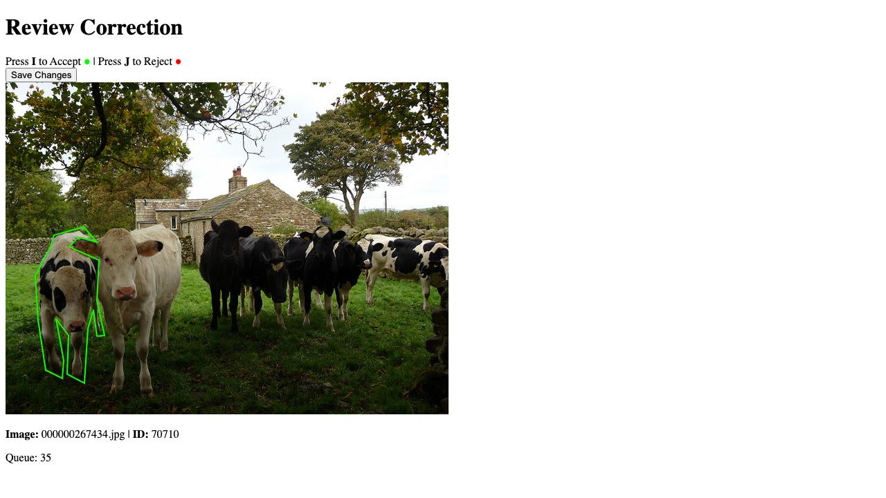
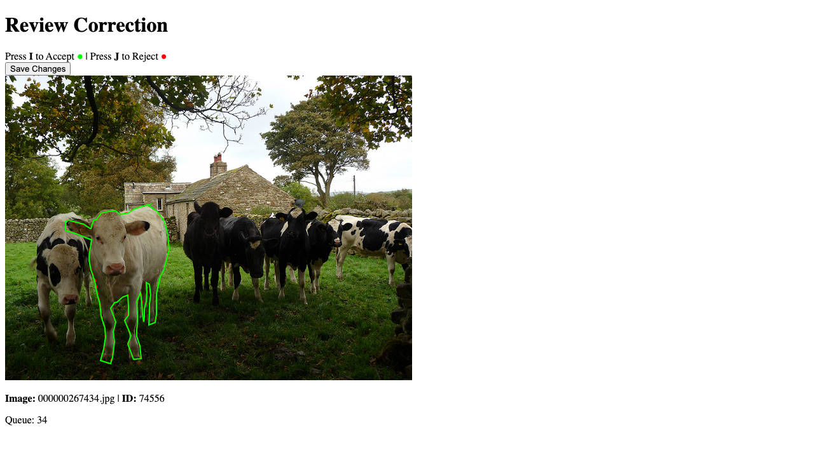

# Segmentation Fixer

A high-performance tool for refining segmentation masks using edge-snapping and advanced computer vision algorithms. Provides a beautiful grid-based UI for comparing and selecting from multiple refinement variations.

## Features

### Core Refinement Algorithms

- **Edge Snapping (Rust)** - Ultra-fast edge detection and vertex snapping with configurable search radius (5-50px)
- **Multiple Variations** - Generate 9+ variations per polygon with different snap distances and smoothing levels
- **Grid Selection UI** - Visual comparison of all variations side-by-side
- **Real-time Preview** - Zoom and pan to inspect refinements in detail

### Advanced Algorithms (Python)

- **GrabCut** - Color/texture-based boundary refinement
- **Active Contours** - Energy minimization for smooth boundaries  
- **Watershed** - Natural region boundary detection
- **Superpixel** - Structure-aware refinement
- **Morphological Operations** - Fast cleanup and smoothing
- **Threshold-based** - Intensity-based segmentation
- **Convex Hull** - Force convex shapes

See [`docs/algorithm_comparison.md`](docs/algorithm_comparison.md) for detailed comparison.

## Architecture

- **Backend:** Rust (high-performance edge detection and snapping) + Python (advanced algorithms)
- **Frontend:** React + Vite (modern UI with grid layout)
- **Data Format:** COCO JSON annotations

## Installation

### Prerequisites

- **Rust** (for backend edge snapping engine)
- **Python 3.11+** with [uv](https://github.com/astral-sh/uv)
- **Node.js 18+** & npm (for frontend)

### Setup

1. **Install Python dependencies:**
   ```bash
   uv sync
   ```

2. **Install frontend dependencies:**
   ```bash
   cd frontend
   npm install
   ```

3. **Build Rust backend:**
   ```bash
   cd backend/coco-edge-checker
   cargo build --release
   ```

4. **Setup pre-commit hooks (optional):**
   ```bash
   uv run pre-commit install
   ```

## Quick Start

### 1. Download Sample Data

```bash
uv run download_coco.py
```

This downloads 5 sample COCO images to `data/coco/`.

### 2. Start the Backend

```bash
cd backend/coco-edge-checker
./target/release/coco-edge-checker \
  --annotations ../../data/coco/annotations.json \
  --images ../../data/coco/images \
  --output ../../data/coco/annotations_fixed.json
```

Backend runs on http://localhost:3000

### 3. Start the Frontend

```bash
cd frontend
npm run dev
```

Frontend runs on http://localhost:5174

### 4. Use the UI

1. Open http://localhost:5174 in your browser
2. View the **original segmentation** at the top
3. **Click a variation** from the grid below that looks best
4. Press **`I`** to accept the selected variation
5. Press **`J`** to reject and move to the next annotation
6. Progress is auto-saved; use "Save Progress" button for manual saves

## Configuration Options

### Edge Detection Parameters

```bash
--canny-low <VALUE>           # Canny low threshold (default: 50)
--canny-high <VALUE>          # Canny high threshold (default: 100)
--gradient-threshold <VALUE>  # Sobel gradient threshold (default: 30)
--snap-distance <VALUE>       # Max snap distance in pixels (default: 5)
--densify-distance <VALUE>    # Point densification distance (default: 5.0)
```

### Current Variations

The system generates these variations automatically:

- **Original** - No changes (baseline)
- **Conservative (5px)** - Minimal adjustment, crisp/smooth
- **Moderate (12px)** - Balanced search, crisp/smooth
- **Aggressive (20px)** - Finds distant edges, crisp/smooth
- **Max Search (35px)** - Large search radius, crisp/smooth
- **Ultra (50px)** - Maximum tolerance for very poor masks

## Advanced Usage

### Generate Synthetic Test Data

Create degraded masks for evaluation:

```bash
uv run src/generate_synthetic_dataset.py \
  --input data/coco/annotations.json \
  --output data/synthetic/degraded \
  --profiles all
```

See [`docs/synthetic_evaluation_plan.md`](docs/synthetic_evaluation_plan.md) for details.

### Use Python Advanced Algorithms

```bash
uv run src/generate_multi_algorithm_variations.py \
  --coco data/coco/annotations.json \
  --images data/coco/images \
  --output data/coco/annotations_advanced.json
```

## Project Structure

```
SegmentationFixer/
├── backend/
│   └── coco-edge-checker/     # Rust edge snapping engine
│       ├── src/
│       │   ├── checker.rs     # Variation generation
│       │   ├── edge.rs        # Edge detection (Canny/Sobel)
│       │   ├── snapping.rs    # Polygon snapping logic
│       │   ├── server.rs      # WebSocket server
│       │   └── types.rs       # COCO data structures
│       └── Cargo.toml
├── frontend/
│   └── src/
│       ├── App.jsx            # Main UI with grid layout
│       └── App.css            # Styling
├── src/
│   ├── advanced_refinement.py           # 7 advanced algorithms
│   ├── generate_multi_algorithm_variations.py
│   └── segmentation_fixer.py            # Legacy SAM wrapper
├── docs/
│   ├── algorithm_comparison.md          # Algorithm details & benchmarks
│   ├── synthetic_evaluation_plan.md     # Evaluation methodology
│   └── roadmap.md                       # Future plans
└── data/
    └── coco/                             # Sample COCO data
```

## Documentation

- **[Algorithm Comparison](docs/algorithm_comparison.md)** - Detailed comparison of all 8 algorithms
- **[Synthetic Evaluation Plan](docs/synthetic_evaluation_plan.md)** - Testing methodology and metrics
- **[Roadmap](docs/roadmap.md)** - Future development plans

## Performance

- **Edge Snapping (Rust):** ~1-5ms per polygon, can process 1000+ per second
- **Advanced Algorithms (Python):** ~50-500ms per polygon depending on method
- **Total Variations:** All 9 variations generated in <50ms per polygon

## Development

### Run Tests

```bash
uv run pytest tests/
```

### Linting

```bash
# Python
uv run ruff check src/

# Frontend
cd frontend && npm run lint
```

### Type Checking

```bash
uv run basedpyright src/
```

### Rust Development

```bash
cd backend/coco-edge-checker
cargo test
cargo clippy
```

## Screenshots

### Grid Selection UI


### Variation Comparison


## Contributing

1. Fork the repository
2. Create a feature branch
3. Make changes and add tests
4. Run linting and tests
5. Submit a pull request

## License

MIT License - see LICENSE file for details

## Citation

If you use this tool in your research, please cite:

```bibtex
@software{segmentation_fixer,
  title={Segmentation Fixer: High-Performance Mask Refinement Tool},
  author={Your Name},
  year={2024},
  url={https://github.com/yourusername/SegmentationFixer}
}
```
